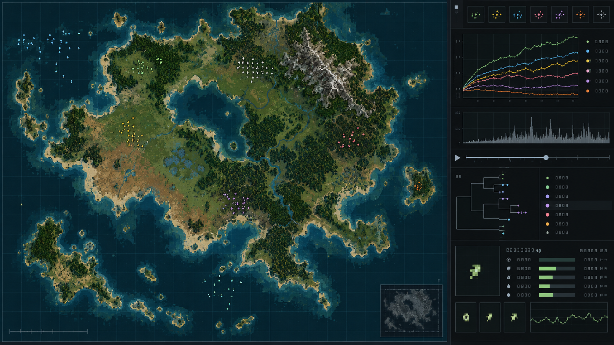
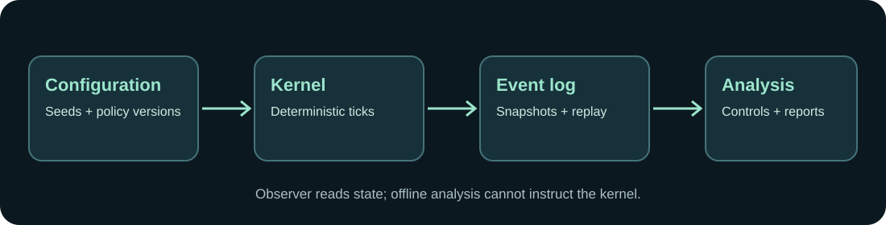

<p align="center"></p>
<h1 align="center">The Genesis Engine</h1>
<p align="center"><strong>A deterministic artificial-life research instrument.</strong></p>
<p align="center">Build worlds, evolve neural-controlled organisms, replay what happened, and test behavioral claims across seeded experiments.</p>
<p align="center">
  <a href="#what-this-project-does">Overview</a> · <a href="#visual-concept">Visual concept</a> · <a href="#research-boundary">Research boundary</a> · <a href="#run-it-locally">Run locally</a> · <a href="#explore-the-repository">Explore the repo</a>
</p>
<p align="center">
  
  
  
</p>

## What this project does

The engine simulates a bounded 2D ecosystem with inheritable controllers, resources, physiology, and an evolving population. Its Rust kernel produces deterministic ticks; the browser observer reads state through a server; versioned logs and snapshots make runs inspectable. A separate experiment harness runs matched seeds and control conditions, while offline analysis evaluates the recorded outcomes.

The goal is to study what can emerge inside an *authored possibility space*. The simulation defines physics and available interactions. It does not assign a technology tree, eras, recipes, or rewards for reaching a civilization stage. Tool use, transmitted behavior, structures, and complex social organization are research ambitions, **not observed results or promised features**. Null findings remain part of the record.

| Area | What is in the repository |
| --- | --- |
| Simulation | Fixed-point, deterministic Rust kernel with evolvable controllers |
| Observation | TypeScript/PixiJS browser observer and binary-protocol server |
| Persistence | Versioned snapshots and an append-only event log |
| Experiments | Campaigns, seeded worlds, manifests, reports, and offline analysis |
| Method | Pre-registered criteria, controls, ablations, benchmark records, and decision logs |

### Current public-repository snapshot

The [backlog](planning/backlog.md) records completed work through Phase 22 and a planned Phase 23 experiment. It also records unfinished work, measured nulls, and an observer/console track in progress. This README is an orientation to the checked-in repository; it does not claim that the long-term artificial-life goals have been achieved or that the private deployment is publicly accessible. Read the backlog and the relevant phase record for the current experimental status.

### Examples of measured work

| Study | What the record says |
| --- | --- |
| [Territory and contest](planning/phase-7-territory-and-conflict.md) | A controlled multi-world study found reduced short-range co-occurrence; its companion aggregation result was confounded. |
| [Demography and life history](planning/phase-8-demography-and-life-history.md) | The primary starvation and resource-field criterion was met; three secondary predictions were not supported by their controls. |
| [Lineages under another intake order](planning/phase-22-lineages-under-the-other-order.md) | A paired probe found more lineages under the alternative order. The shipped order was not changed based on that probe. |

These are bounded results from particular campaigns, not proof of open-ended evolution. Each phase record states its seeds, comparison, and limits.

## Visual concept

**Illustrative concept art, generated for this README.**



*This is not a capture of the running observer, measured simulation output, or evidence that every pictured control exists.* The actual observer is defined by the [interface documentation](docs/10-observer-interface.md) and [source](apps/observer/src/main.ts).

## Research boundary



Three boundaries shape the project:

1. **Replayable world state.** Seed, configuration, policy versions, and event history make runs comparable.
2. **An observer that reads the world.** The browser visualizes and requests actions; the server validates requests and owns simulation state.
3. **Analysis that cannot steer the world.** Offline results never feed a rule, input channel, or intervention. Behavioral claims require multiple seeds and a stated control or ablation.

The [emergence and epistemic position](docs/25-emergence-and-epistemic-position.md) explains the difference between a possible mechanism, an aspiration, and a result supported by measurement.

## Run it locally

The repository includes a bootstrap script for its development toolchain. From the repository root:

```sh
scripts/bootstrap-phase0-toolchain.sh
cargo build --release -p sim-server
target/release/lifesim-server
```

The server prints generated tokens needed by the observer. In a second terminal:

```sh
cd apps/observer
npm install
npm run dev
```

The observer is a local development client. Production hosting is private; the [server workflow](docs/28-server-development-workflow.md) describes that boundary.

### Run a seeded campaign

```sh
cargo build --release -p sim-cli
target/release/lifesim fields
target/release/lifesim batch --campaign my.campaign --output runs/ --workers 4
target/release/lifesim report --manifest runs/manifest.txt
```

Use `lifesim fields` to inspect settable configuration fields and the [experiment configuration schema](specifications/experiment-config-schema.md) when creating a campaign. Existing campaign definitions under [`experiments/`](experiments/) show the project’s recorded studies. Report claims depend on their specific seeds, controls, and criteria.

## Explore the repository

| Start here | For |
| --- | --- |
| [Vision](docs/00-project-vision.md) and [scope](docs/02-scope-and-non-goals.md) | The aim, constraints, and explicit non-goals |
| [Architecture](docs/03-system-architecture.md) and [simulation model](docs/04-simulation-model.md) | Components, tick ownership, and data flow |
| [Observer interface](docs/10-observer-interface.md) | Current and proposed views and controls |
| [Backlog](planning/backlog.md) and [decision log](docs/22-decision-log.md) | Phase status, measured results, and unresolved decisions |
| [Benchmarks](benchmarks/README.md) | Reproduction steps and performance evidence |
| [Agent guide](AGENTS.md) and [Codex guide](CODEX.md) | Contribution workflow and research safeguards |

The core code lives in [`crates/sim-core`](crates/sim-core), [`crates/sim-experiment`](crates/sim-experiment), [`crates/sim-analysis`](crates/sim-analysis), [`crates/sim-persist`](crates/sim-persist), and [`apps/observer`](apps/observer). Specifications live in [`specifications/`](specifications/).

## Contributing and interpretation

Read [AGENTS.md](AGENTS.md) and the relevant phase documents before changing simulation behavior. Preserve deterministic replay, versioned formats, and the separation between simulation and analysis. A visual pattern in one run is a question to test, not a behavioral finding.
